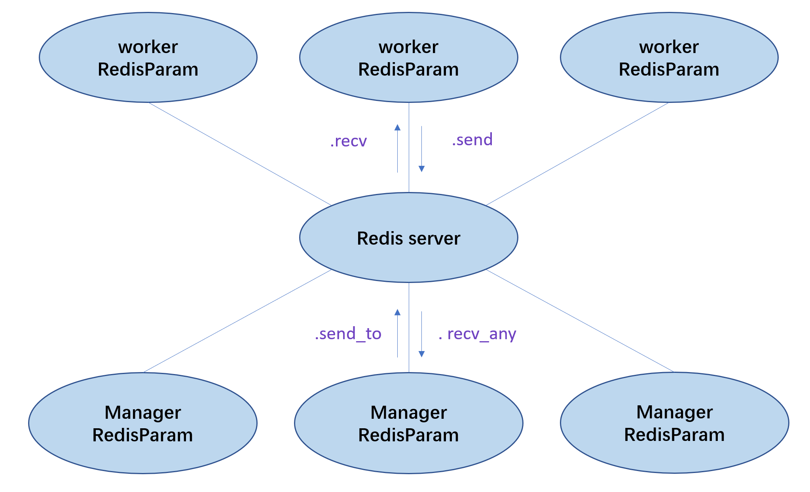
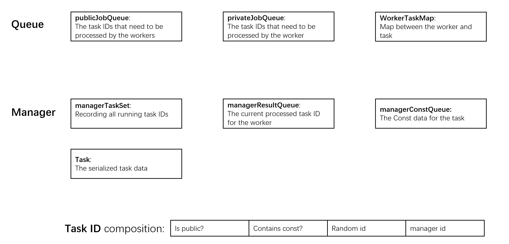
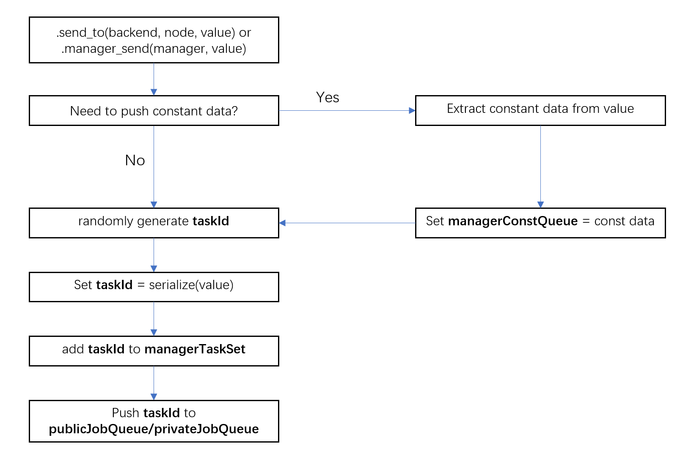
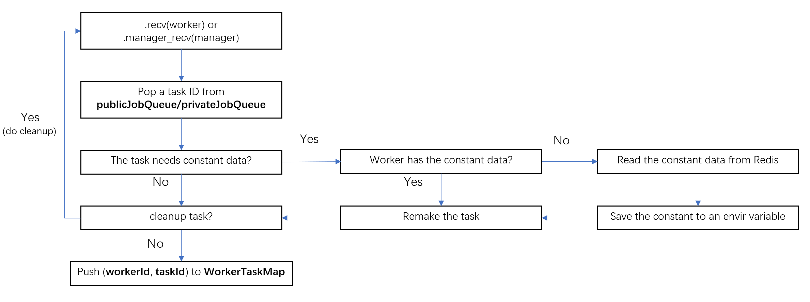

```{r setup, include = FALSE}
knitr::opts_chunk$set(
  collapse = TRUE,
  comment = "#>"
)
```

# Introduction
This vignette is for the developer who wants to understand the secret behind `RedisParam`. The regular user does not need to read this document for using the package.

# General design principles
The image below shows the framework of `RedisParam`. Unlike the traditional one-to-many structure where the worker only serves one manager. `RedisParam` allows for multiple managers and workers to connect with the same job queue. The job is done in a first-come, first-serve basis. 




For making the package robust, `RedisParam` is developed with a few principles in mind. 

2. resisting worker loss: A worker might be died at any time for any reason, the manager must be able to find the missing task due to the died worker and resubmit the task.

3. Job queue robustness: Since any one can destroy the entire data on the server at any time. The job queue, the bridge between the manager and worker, must be resilient. After a data loss, the current job can fail but the queue should be still able to process new jobs. 

For implementing the package while satisfying the design principles, we require that maintaining the job queue on the server should not need any data on the server. Therefore, even if all data in Redis has been lost, the connection between the manager and workers should still be maintained.

# Data structure in Redis
The data used in Redis can be divided into three components: queue, manager data. Just as the image shows




Public data is the data that can be viewed by all managers and workers with the same job queue name. It includes

1. public job queue: The main job queue used to send the task to the worker
1. private job queue: A private queue for a specific worker
2. worker-task map: A map between the worker ID and the task ID

The manager data has

1. constant queue: This is not a queue, but an object which is used to store the data that does not vary across all tasks. We call it a queue as it is implemented using the list structure in Redis

2. manager result queue: The queue which stores the results from the worker

3. manager task(s): The serialized task data. The task ID contains information about whether it is a public task and whether it requires constant data, so the worker can use it to quickly determine if it needs to download the constant data from Redis.

3. manager task set: A set of task ID which the manager has sent to the public queue and haven't finished by the worker


# Workflow
## Manager
### submit a task to Redis
The manager has two functions to send the task to the worker, namely `.send_to` and `.manager_send`. The former one is used to send the task to a specific worker(private queue) while the later one can send the task to any worker(public queue). Below is the workflow of the task submission.


### receive a result from Redis
The receiving operation is a blocking operation, it will block the r session for a few seconds if there is no result available, then check for if there is any missing tasks, then blocks R again. The manager will use the `BLPOP` operation to pop the result from `managerResultQueue` in Redis

## worker
## receive a task from Redis
Receiving the task from the job queue in the worker requires a little more work. The worker will try to pop the task ID from both public and private queues. This is a blocking operation so the worker only continues when there is at least one task available. Once the worker received the task, it decompose the task ID to determine the manager ID and whether the task needs the constant data. Then get the task data and its constant data(if required). The worker also needs to cache the constant data for the future tasks. Below is the workflow for receiving a task in the worker




## send a result to Redis
When sending back the result to Redis, the worker is responsible to check whether the manager still has the task ID in `managerTaskSet`. By doing this, we make sure there will not be any unnecessary data transmission and the manager would not receive an incorrect result. This can happens if the user interrupt the manager process before the job is finished or the Redis server loses all its data(either on purpose or by accident). 

If the manager still has the task ID, the worker will then push the result to `managerResultQueue`, then removes the task ID from `managerTaskSet`, the worker ID from `workerTaskMap` and deletes the task itself from Redis.


